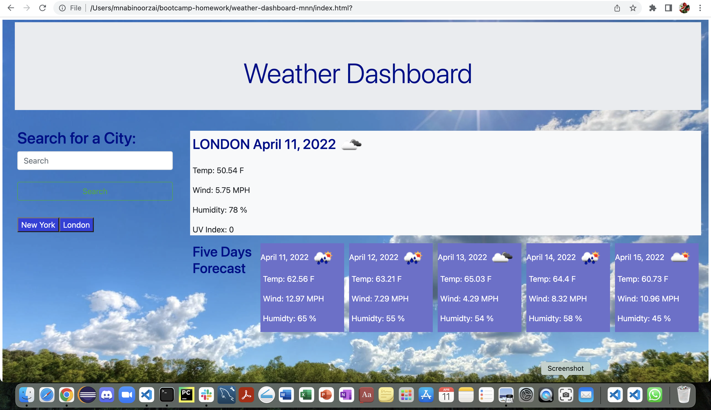

# Weather Dashboard - MNN

## Overview

Weather Dashboard is a responsive web application that allows users to search for a city and view its current weather and forecast for the next five days. This project utilizes HTML, CSS, and JavaScript to provide an intuitive user interface and dynamic functionality. By implementing the OpenWeatherMap API, users can access real-time weather data for cities around the world.

### Key Features:
- **City Search:** Users can input any city to retrieve weather information.
- **Current Weather:** Displays current temperature, humidity, wind speed, and weather description.
- **Five-Day Forecast:** Provides the weather forecast for the next five days.
- **Responsive Design:** The app is optimized for various screen sizes and devices.
- **Search History:** Users can view and access previous city searches for convenience.

## Technologies Used:
- **HTML**: Structuring the page and content.
- **CSS**: Styling the app and ensuring responsiveness across devices.
- **JavaScript**: Handling dynamic functionality, including API calls, data rendering, and user interaction.
- **OpenWeatherMap API**: Fetching real-time weather data for cities.

## Learnings:
During the development of this app, I gained hands-on experience in:
- Writing JavaScript functions to fetch data and handle user input.
- Making `fetch` requests to interact with external APIs.
- Parsing and displaying JSON data returned from API calls.
- Implementing a responsive layout using Bootstrap.
- Storing and managing search history in localStorage for an enhanced user experience.

## Live Demo

You can view the live version of the app here:  
[Weather Dashboard Live](https://mnoorzai21.github.io/weather-dashboard-mnn/)

## Screenshot

